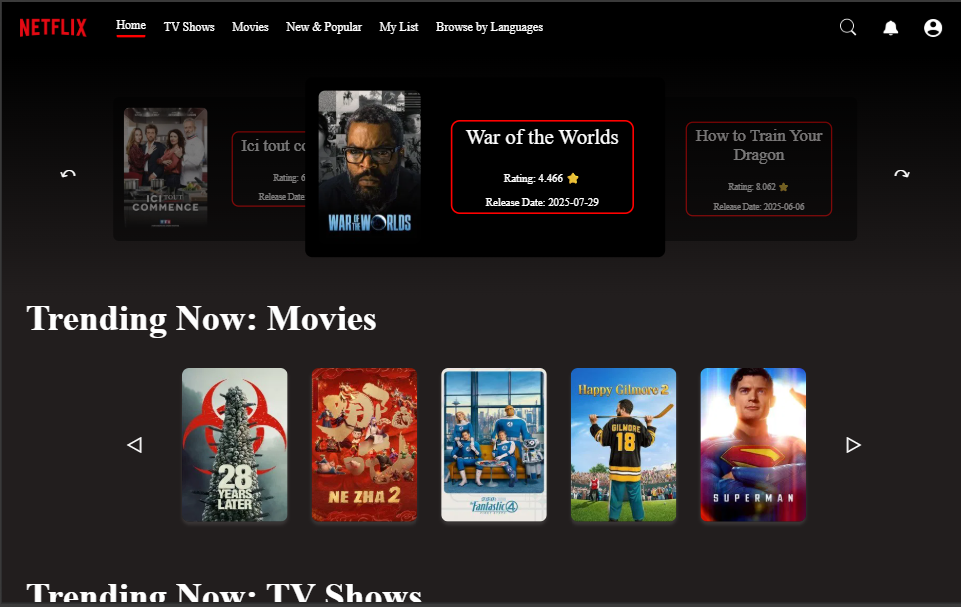
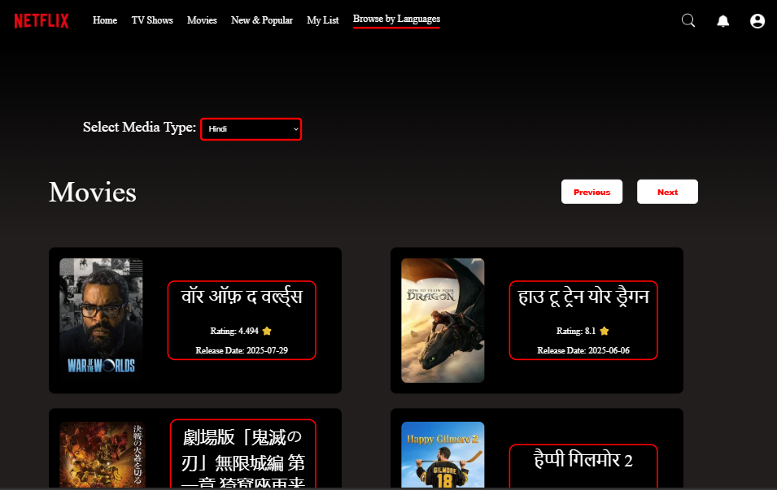
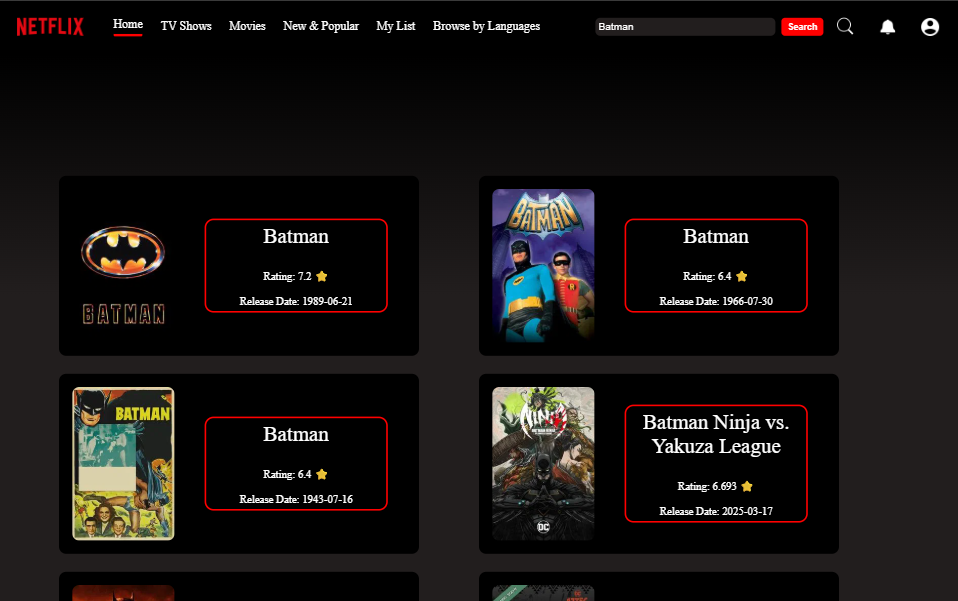
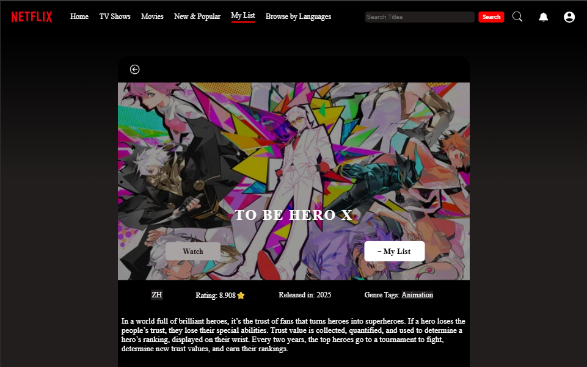
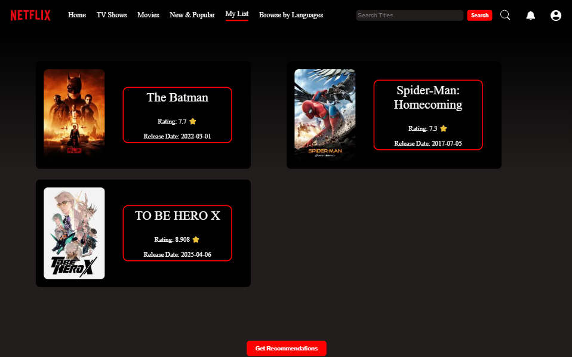
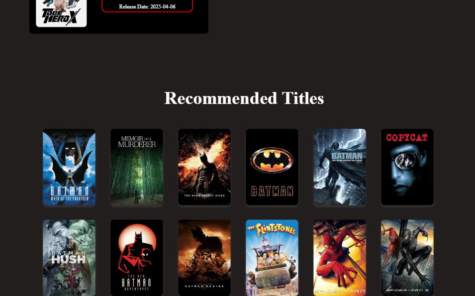

# Netflix From Temu

An older and former frontend-only project of mine recreating the abilities of the famous streaming platform using React JS. This project is solely for learning purposes and does not intend to misuse or undermine the concerned organization. The project includes various features including browsing on the basis of language and genres, searching for specific titles as well as the ability to add and save your favourites. Additionally, a recommendation model has also been implemented which suggests similar titles to the user based on the user's list (favourites). Data for the titles has been integrated using The Movie Database (TMDB)'s API.

# Demo Screenshots:

